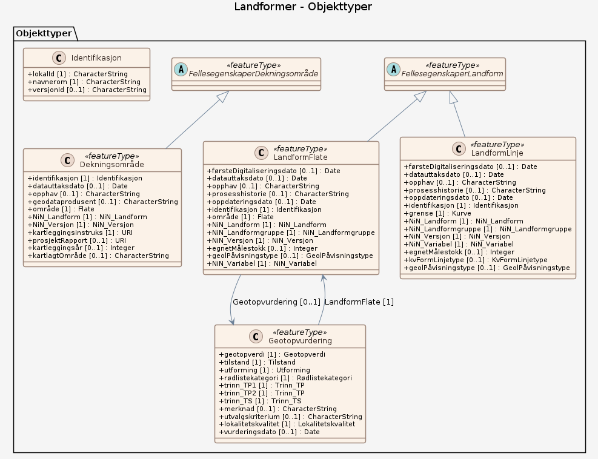

# Produktspesifikasjon: Landformer

## Generelt om spesifikasjonen

### Unik identifisering

7d220e23-5835-4f83-ba96-1156c154e566

#### Fullstendig navn

Landformer

#### Versjon

2025-11-26

### Referansedato

2026-03-03

### Ansvarlig organisasjon

Norges geologiske undersøkelse

### Språk

nor

### Sammendrag

Datasettet viser landformer, geotopverdi og dekning. Data for landformer består av linjer og polygoner. Kartlegging av ulike landformtyper er pågående, og dekningsgrad av ulike landformtyper varierer. Datasettet inneholder også landformer som er verdivurdert i henhold til geotopverdsettings-kriteriene, beskrevet i veilederen M-1941 Konsekvensutredninger for klima og miljø. Landformer er geologiske formasjoner i landskapet som er definert ut fra form og utseende, og ut fra hvilke prosesser som har dannet dem. Landformtypene er definert i i NiN (Natur i Norge). Et utvalg av rødlistede landformer har tidligere blitt kartlagt etter Miljødirektoratets instruks (Christoffersen mfl. 2021; van Boeckel mfl. 2023, 2024) og blitt publisert ved Miljødirektoratet under navnet “Landformer”. Datasettet viser ikke landformer i marint miljø.

### Formål

Et av de viktigste formålene med datasettet er å visualisere spredning av landformer og tilhørende verdi i konsekvensutredninger. Datasettet er utviklet med tanke på bruk i konsekvensutredninger og arealplaner. Datasettet kan også være nyttig i annen arealforvaltning der det er behov for å ha oversikt over utbredelsen av landformdannende prosesser.

### Bruksområde

Et av de viktigste formålene med datasettet er å visualisere spredning av landformer og tilhørende verdi i konsekvensutredninger.
Datasettet er utviklet med tanke på bruk i konsekvensutredninger og arealplaner. Datasettet kan også være nyttig i annen arealforvaltning der det er behov for å ha oversikt over utbredelsen av landformdannende prosesser. For eksempel kan utbredelse av leirraviner vise hvor ravinering finner sted; og utbredelse av leirskredgroper vise hvor skred, som kvikkleireskred, har forekommet i hav- og fjordavsetninger. Datasettet kan også brukes for temakart, analyser m.m.

### Romlig representasjonstype

Vektor

### Utstrekning

**Geografisk utstrekning**:

- **Vest**: 2.0
- **Øst**: 33.0
- **Sør**: 57.0
- **Nord**: 72.0

**Tidsmessig utstrekning**:

- **Tidsperiode**:
  - **Fra**: 2025-11-26
  - **Til**: 2026-03-03

### Begrensninger

**Juridiske begrensninger**:

- **Tilgangsbegrensninger**: Åpne data
- **Bruksbegrensninger**: Lisens
- **Lisens**: Norsk lisens for offentlige data (NLOD)
- **Lisenslenke**: <http://data.norge.no/nlod/no/1.0>

## Spesifikasjonsomfang

- **Omfang**:

  - **Identifikasjon**: hele datasettet
  - **Nivå**: dataset
  - **Utstrekning**: - **Beskrivelse**: National

## Innhold og struktur

**Beskrivelse**:
Et av de viktigste formålene med datasettet er å visualisere spredning av landformer og tilhørende verdi i konsekvensutredninger.
Datasettet er utviklet med tanke på bruk i konsekvensutredninger og arealplaner. Datasettet kan også være nyttig i annen arealforvaltning der det er behov for å ha oversikt over utbredelsen av landformdannende prosesser. For eksempel kan utbredelse av leirraviner vise hvor ravinering finner sted; og utbredelse av leirskredgroper vise hvor skred, som kvikkleireskred, har forekommet i hav- og fjordavsetninger. Datasettet kan også brukes for temakart, analyser m.m.

### Datamodell

#### LandformFlate

Omfatter mer eller mindre distinkte områder med terrengformer, som kan gis en felles karakteristikk på grunnlag av egenskaper som er forårsaket av landformdannende (geomorfologiske) prosesser

Egenskaper

<table class="feature-attribute-table">
  <colgroup>
    <col style="width: 35%;" />
    <col style="width: 65%;" />
  </colgroup>
  <tbody>
    <tr>
      <th scope="row">Navn:</th>
      <td><strong>område</strong></td>
    </tr>
    <tr>
      <th scope="row">Definisjon:</th>
      <td>objektets utstrekning</td>
    </tr>
    <tr>
      <th scope="row">Multiplisitet:</th>
      <td>1</td>
    </tr>
    <tr>
      <th scope="row">Type:</th>
      <td>Flate</td>
    </tr>
  </tbody>
</table>

<table class="feature-attribute-table">
  <colgroup>
    <col style="width: 35%;" />
    <col style="width: 65%;" />
  </colgroup>
  <tbody>
    <tr>
      <th scope="row">Navn:</th>
      <td><strong>NiN_Landform</strong></td>
    </tr>
    <tr>
      <th scope="row">Definisjon:</th>
      <td>NiN kode landformenhet</td>
    </tr>
    <tr>
      <th scope="row">Multiplisitet:</th>
      <td>1</td>
    </tr>
    <tr>
      <th scope="row">Type:</th>
      <td>NiN_Landform</td>
    </tr>
    <tr>
      <th scope="row">Tillatte verdier:</th>
      <td>- 3AB-DG Dødisgrop – &lt;a href="<a href="http://adb-prod-ninkapi-as.azurewebsites.net/v2.3/variasjon/hentkode/3AB_DG"&gt;&lt;font">http://adb-prod-ninkapi-as.azurewebsites.net/v2.3/variasjon/hentkode/3AB_DG"&gt;&lt;font</a> color="#467886"&gt;&lt;u&gt;<a href="https://adb-prod-ninkapi-as.azurewebsites.net/v2.3/variasjon/hentkode/3AB_DG&lt;/u&gt;&lt;/font&gt;&lt;/a&gt">https://adb-prod-ninkapi-as.azurewebsites.net/v2.3/variasjon/hentkode/3AB_DG&lt;/u&gt;&lt;/font&gt;&lt;/a&gt</a>; Forsenkning dannet ved nedsmelting av stor isklump begravd i løsmasser - 3AR-DE Delta – &lt;a href="<a href="http://adb-prod-ninkapi-as.azurewebsites.net/v2.3/variasjon/hentkode/3AR_DE"&gt;&lt;font">http://adb-prod-ninkapi-as.azurewebsites.net/v2.3/variasjon/hentkode/3AR_DE"&gt;&lt;font</a> color="#467886"&gt;&lt;u&gt;<a href="https://adb-prod-ninkapi-as.azurewebsites.net/v2.3/variasjon/hentkode/3AR_DE&lt;/u&gt;&lt;/font&gt;&lt;/a&gt">https://adb-prod-ninkapi-as.azurewebsites.net/v2.3/variasjon/hentkode/3AR_DE&lt;/u&gt;&lt;/font&gt;&lt;/a&gt</a>; Avsetning av elvetransportert materiale omkring elvemunning i stillestående vann - 3ER-RL Leirravine – &lt;a href="<a href="http://adb-prod-ninkapi-as.azurewebsites.net/v2.3/variasjon/hentkode/3ER_RL"&gt;&lt;font">http://adb-prod-ninkapi-as.azurewebsites.net/v2.3/variasjon/hentkode/3ER_RL"&gt;&lt;font</a> color="#467886"&gt;&lt;u&gt;<a href="https://adb-prod-ninkapi-as.azurewebsites.net/v2.3/variasjon/hentkode/3ER_RL&lt;/u&gt;&lt;/font&gt;&lt;/a&gt">https://adb-prod-ninkapi-as.azurewebsites.net/v2.3/variasjon/hentkode/3ER_RL&lt;/u&gt;&lt;/font&gt;&lt;/a&gt</a>; Liten, skarpt nedskåret V-dal, ofte med bratt lengdeprofil, gravd ut av rennende vann i marint leirsediment - 3ER-JP Jordpyramide – &lt;a href="<a href="http://adb-prod-ninkapi-as.azurewebsites.net/v2.3/variasjon/hentkode/3ER_JP"&gt;&lt;font">http://adb-prod-ninkapi-as.azurewebsites.net/v2.3/variasjon/hentkode/3ER_JP"&gt;&lt;font</a> color="#467886"&gt;&lt;u&gt;<a href="https://adb-prod-ninkapi-as.azurewebsites.net/v2.3/variasjon/hentkode/3ER_JP&lt;/u&gt;&lt;/font&gt;&lt;/a&gt">https://adb-prod-ninkapi-as.azurewebsites.net/v2.3/variasjon/hentkode/3ER_JP&lt;/u&gt;&lt;/font&gt;&lt;/a&gt</a>; Søyleform i hardpakket morene - 3ML-LS Leirskred(grop) – &lt;a href="<a href="http://adb-prod-ninkapi-as.azurewebsites.net/v2.3/variasjon/hentkode/3ML_LS"&gt;&lt;font">http://adb-prod-ninkapi-as.azurewebsites.net/v2.3/variasjon/hentkode/3ML_LS"&gt;&lt;font</a> color="#467886"&gt;&lt;u&gt;<a href="https://adb-prod-ninkapi-as.azurewebsites.net/v2.3/variasjon/hentkode/3ML_LS&lt;/u&gt;&lt;/font&gt;&lt;/a&gt">https://adb-prod-ninkapi-as.azurewebsites.net/v2.3/variasjon/hentkode/3ML_LS&lt;/u&gt;&lt;/font&gt;&lt;/a&gt</a>; Grop etter kvikk-leirskred (leirfall)</td>
    </tr>
  </tbody>
</table>

<table class="feature-attribute-table">
  <colgroup>
    <col style="width: 35%;" />
    <col style="width: 65%;" />
  </colgroup>
  <tbody>
    <tr>
      <th scope="row">Navn:</th>
      <td><strong>NiN_Landformgruppe</strong></td>
    </tr>
    <tr>
      <th scope="row">Definisjon:</th>
      <td>NiN kode landformgruppe. Samling av en eller flere spesifikke landformenheter med klare fellestrekk.</td>
    </tr>
    <tr>
      <th scope="row">Multiplisitet:</th>
      <td>1</td>
    </tr>
    <tr>
      <th scope="row">Type:</th>
      <td>NiN_Landformgruppe</td>
    </tr>
    <tr>
      <th scope="row">Tillatte verdier:</th>
      <td>- 3ER Erosjonsformer knyttet til rennende vann – <a href="https://adb-prod-ninkapi-as.azurewebsites.net/v2.3/variasjon/hentkode/3ER">https://adb-prod-ninkapi-as.azurewebsites.net/v2.3/variasjon/hentkode/3ER</a> - 3ML Landformer knyttet til massebevegelse på land – &lt;a href="<a href="http://adb-prod-ninkapi-as.azurewebsites.net/v2.3/variasjon/hentkode/3ML_LS"&gt;&lt;font">http://adb-prod-ninkapi-as.azurewebsites.net/v2.3/variasjon/hentkode/3ML_LS"&gt;&lt;font</a> color="#467886"&gt;&lt;u&gt;<a href="http://adb-prod-ninkapi-as.azurewebsites.net/v2.3/variasjon/hentkode/3ML&lt;/u&gt;&lt;/font&gt;&lt;/a&gt">http://adb-prod-ninkapi-as.azurewebsites.net/v2.3/variasjon/hentkode/3ML&lt;/u&gt;&lt;/font&gt;&lt;/a&gt</a>; - 3AB Avsetningsformer knyttet til breer – <a href="https://adb-prod-ninkapi-as.azurewebsites.net/v2.3/variasjon/hentkode/3AB">https://adb-prod-ninkapi-as.azurewebsites.net/v2.3/variasjon/hentkode/3AB</a> - 3AR Avsetningsformer knyttet til rennende vann – <a href="https://adb-prod-ninkapi-as.azurewebsites.net/v2.3/variasjon/hentkode/3AR">https://adb-prod-ninkapi-as.azurewebsites.net/v2.3/variasjon/hentkode/3AR</a></td>
    </tr>
  </tbody>
</table>

<table class="feature-attribute-table">
  <colgroup>
    <col style="width: 35%;" />
    <col style="width: 65%;" />
  </colgroup>
  <tbody>
    <tr>
      <th scope="row">Navn:</th>
      <td><strong>NiN_Versjon</strong></td>
    </tr>
    <tr>
      <th scope="row">Definisjon:</th>
      <td>NiN versjon</td>
    </tr>
    <tr>
      <th scope="row">Multiplisitet:</th>
      <td>1</td>
    </tr>
    <tr>
      <th scope="row">Type:</th>
      <td>NiN_Versjon</td>
    </tr>
    <tr>
      <th scope="row">Tillatte verdier:</th>
      <td>- 2.3 – NiN versjon 2.3 - 3.0 – NiN versjon 3.0</td>
    </tr>
  </tbody>
</table>

<table class="feature-attribute-table">
  <colgroup>
    <col style="width: 35%;" />
    <col style="width: 65%;" />
  </colgroup>
  <tbody>
    <tr>
      <th scope="row">Navn:</th>
      <td><strong>egnetMålestokk</strong></td>
    </tr>
    <tr>
      <th scope="row">Definisjon:</th>
      <td>Beskriver det målestokksområdet hvor dataene er best egnet. Egenskapen viser målestokktallet, eksempel: 1:50 000 = 50000. Objekter kan være utvalgt, plassert eller generalisert i forhold til egnet målestokk. Denne egenskapen kan benyttes for å velge hvilke objekter som skal tegnes ut i ulike målestokker.</td>
    </tr>
    <tr>
      <th scope="row">Multiplisitet:</th>
      <td>0..1</td>
    </tr>
    <tr>
      <th scope="row">Type:</th>
      <td>Integer</td>
    </tr>
  </tbody>
</table>

<table class="feature-attribute-table">
  <colgroup>
    <col style="width: 35%;" />
    <col style="width: 65%;" />
  </colgroup>
  <tbody>
    <tr>
      <th scope="row">Navn:</th>
      <td><strong>geolPåvisningstype</strong></td>
    </tr>
    <tr>
      <th scope="row">Definisjon:</th>
      <td>hvor sikkert et geologisk objekt er påvist i terrenget, eller hvilken metode som ligger til grunn for å påvisningen/registreringen</td>
    </tr>
    <tr>
      <th scope="row">Multiplisitet:</th>
      <td>0..1</td>
    </tr>
    <tr>
      <th scope="row">Type:</th>
      <td>GeolPåvisningstype</td>
    </tr>
    <tr>
      <th scope="row">Tillatte verdier:</th>
      <td>- Ikke spesifisert - Sikker påvisning/observasjon – Avgrensningen eller registreringen av objektet er påvist eller observert i felt - Usikker påvisning/observasjon – Ikke påvist/observert men antatt avgrensning/registrering av objekt - Konstruert avgrensning – Tilfeldig plassert avgrensning og meget usikker.  Benyttes blant annet under vann- eller breoverflater - Geofysisk tolket grense – Avgrensning basert på geofysiske indikasjoner - Dårlig synlig avgrensning i terrenget – Basert på generalisert tolkning av objekter med små innbyrdes variasjoner (f.eks. skille mellom tynt humusdekke og bart fjell, eller mellom to svært like bergarter) - Overgangsmessig grense – Glidende overgang mellom to bergarter,  jordarter o.l. - Tolket avgrensning/registrering – Avgrensninger av geologisk objekt eller delobjekt fremkommet ved generalisering, samtolkning eller aggregering - Flyfototolket objekt eller delobjekt - Observasjon med usikker geografisk beliggenhet - Avgrensning ikke basert på geologi – Der f.eks. en administrativ grense eller kystkontur har bidratt til avgrensning av et geologisk objekt - Avgrensning basert på geofysiske data/metoder verifisert ved prøvetaking - Avgrensning basert på tolkning av tilgjengelige geologiske/geofysiske data (varierende oppløsning), litteratur og kart - Avgrensning basert på geologisk observasjon i felt, prøvetaking og analyser - Tolket avgrensning basert på tilgjengelig geologisk kartlegging - Avgrensning basert på prøvetaking - Avgrensning basert på seismikk - Avgrensning basert på detaljerte dybdedata – Avgrensning ved bruk av multistråleekkolodd eller interferometrisk sonar - Avgrensning basert på backscatter data/sidescan.sonar – Avgrensning basert på bunnreflektivitet/data fra sidescan.sonar - Avgrensning basert på prøvetaking og akustiske data/metoder - Avgrensning basert på akustiske data/metoder - Avgrensning basert på flere metoder/datatyper - Avgrensning basert på undervannsfoto og/eller -video - Avgrensning basert på akustiske data/metoder verifisert ved prøvetaking, foto o.l. - Avgrensningen er foretatt ut fra tolkning basert på tilgjengelige batymetriske data (varierende oppløsning), litteratur og kart - Avgrensning basert på Lidardata, flyfoto og/eller multi-/hyperspektrale bilder og eksisterende geologisk informasjon - Avgrensning basert på romlig modellering med utgangspunkt i detaljerte dybdedata - Avgrensning basert på romlig modellering med utgangspunkt i detaljerte dybdedata, prøvetaking samt fysiske datasett som strøm, bølger, eksponering og lysforhold</td>
    </tr>
  </tbody>
</table>

<table class="feature-attribute-table">
  <colgroup>
    <col style="width: 35%;" />
    <col style="width: 65%;" />
  </colgroup>
  <tbody>
    <tr>
      <th scope="row">Navn:</th>
      <td><strong>NiN_Variabel</strong></td>
    </tr>
    <tr>
      <th scope="row">Definisjon:</th>
      <td>Gjelder per i dag kun delta og dødisgrop. Variablen blir brukt i kartlegging for å skille en underkategori fra hovedtypen</td>
    </tr>
    <tr>
      <th scope="row">Multiplisitet:</th>
      <td>1</td>
    </tr>
    <tr>
      <th scope="row">Type:</th>
      <td>NiN_Variabel</td>
    </tr>
    <tr>
      <th scope="row">Tillatte verdier:</th>
      <td>- Fossilt - I sortert materiale</td>
    </tr>
  </tbody>
</table>

Relasjoner

**Arv**
FellesegenskaperLandform

**Assosiasjoner**
Geotopvurdering – rolle: Geotopvurdering – kardinalitet: 0..1

#### FellesegenskaperLandform (abstrakt)

abstrakt objekttype som bærer en rekke egenskaper som er fagområde-uavhengige og kan benyttes for alle objekttyper  Merknad: Spesielt i produktspesifikasjonsarbeid vil en velge egenskaper og av grensningslinjer fra denne klassen.

Egenskaper

<table class="feature-attribute-table">
  <colgroup>
    <col style="width: 35%;" />
    <col style="width: 65%;" />
  </colgroup>
  <tbody>
    <tr>
      <th scope="row">Navn:</th>
      <td><strong>førsteDigitaliseringsdato</strong></td>
    </tr>
    <tr>
      <th scope="row">Definisjon:</th>
      <td>dato når en representasjon av objektet i digital form første gang ble etablert  Merknad: førsteDigitaliseringsdato kan skille seg fra førsteDatafangstdato ved at den første datafangsten skjedde analogt og gjort om til digital form senere i en produksjonsprosess. Eventuelt at innlegging i databasen skjedde på et senere tidspunkt enn registreringen /observasjonen / målingen av objektet.</td>
    </tr>
    <tr>
      <th scope="row">Multiplisitet:</th>
      <td>0..1</td>
    </tr>
    <tr>
      <th scope="row">Type:</th>
      <td>DateTime</td>
    </tr>
  </tbody>
</table>

<table class="feature-attribute-table">
  <colgroup>
    <col style="width: 35%;" />
    <col style="width: 65%;" />
  </colgroup>
  <tbody>
    <tr>
      <th scope="row">Navn:</th>
      <td><strong>datauttaksdato</strong></td>
    </tr>
    <tr>
      <th scope="row">Definisjon:</th>
      <td>dato for uttak fra en database  Merknad: Skiller seg fra Kopidato ved at en ikke skiller på om det er uttak fra en originaldatabase eller en kopidatabase.</td>
    </tr>
    <tr>
      <th scope="row">Multiplisitet:</th>
      <td>0..1</td>
    </tr>
    <tr>
      <th scope="row">Type:</th>
      <td>DateTime</td>
    </tr>
  </tbody>
</table>

<table class="feature-attribute-table">
  <colgroup>
    <col style="width: 35%;" />
    <col style="width: 65%;" />
  </colgroup>
  <tbody>
    <tr>
      <th scope="row">Navn:</th>
      <td><strong>opphav</strong></td>
    </tr>
    <tr>
      <th scope="row">Definisjon:</th>
      <td>referanse til opphavsmaterialet, kildematerialet, organisasjons/publiseringskilde  Merknad: Kan også beskrive navn på person og årsak til oppdatering</td>
    </tr>
    <tr>
      <th scope="row">Multiplisitet:</th>
      <td>0..1</td>
    </tr>
    <tr>
      <th scope="row">Type:</th>
      <td>CharacterString</td>
    </tr>
  </tbody>
</table>

<table class="feature-attribute-table">
  <colgroup>
    <col style="width: 35%;" />
    <col style="width: 65%;" />
  </colgroup>
  <tbody>
    <tr>
      <th scope="row">Navn:</th>
      <td><strong>prosesshistorie</strong></td>
    </tr>
    <tr>
      <th scope="row">Definisjon:</th>
      <td>beskrivelse av de prosesser som dataene er gått gjennom som kan ha betydning for kvaliteten og bruken av dataene  Merknad: Prosesshistorie vil kunne inneholde informasjon om transformasjoner. Hva slags informasjon som angis er ofte gitt i andre standarder, f.eks kvalitet og kvalitetsikring.</td>
    </tr>
    <tr>
      <th scope="row">Multiplisitet:</th>
      <td>0..1</td>
    </tr>
    <tr>
      <th scope="row">Type:</th>
      <td>CharacterString</td>
    </tr>
  </tbody>
</table>

<table class="feature-attribute-table">
  <colgroup>
    <col style="width: 35%;" />
    <col style="width: 65%;" />
  </colgroup>
  <tbody>
    <tr>
      <th scope="row">Navn:</th>
      <td><strong>oppdateringsdato</strong></td>
    </tr>
    <tr>
      <th scope="row">Definisjon:</th>
      <td>tidspunkt for siste endring på objektet  Merknad: Oppdateringsdato kan være forskjellig fra datafangsdato ved at data som er registrert kan bufres en kortere eller lengre periode før disse legges inn i datasystemet (databasen).</td>
    </tr>
    <tr>
      <th scope="row">Multiplisitet:</th>
      <td>0..1</td>
    </tr>
    <tr>
      <th scope="row">Type:</th>
      <td>DateTime</td>
    </tr>
  </tbody>
</table>

<table class="feature-attribute-table">
  <colgroup>
    <col style="width: 35%;" />
    <col style="width: 65%;" />
  </colgroup>
  <tbody>
    <tr>
      <th scope="row">Navn:</th>
      <td><strong>identifikasjon</strong></td>
    </tr>
    <tr>
      <th scope="row">Definisjon:</th>
      <td>unik identifikasjon av et objekt</td>
    </tr>
    <tr>
      <th scope="row">Multiplisitet:</th>
      <td>1</td>
    </tr>
    <tr>
      <th scope="row">Type:</th>
      <td>Identifikasjon</td>
    </tr>
  </tbody>
</table>

<table class="feature-attribute-table">
  <colgroup>
    <col style="width: 35%;" />
    <col style="width: 65%;" />
  </colgroup>
  <tbody>
    <tr>
      <th scope="row">Navn:</th>
      <td><strong>identifikasjon.lokalId</strong></td>
    </tr>
    <tr>
      <th scope="row">Definisjon:</th>
      <td>lokal identifikator av et objekt  Merknad: Det er dataleverendørens ansvar å sørge for at den lokale identifikatoren er unik innenfor navnerommet.</td>
    </tr>
    <tr>
      <th scope="row">Multiplisitet:</th>
      <td>1</td>
    </tr>
    <tr>
      <th scope="row">Type:</th>
      <td>CharacterString</td>
    </tr>
  </tbody>
</table>

<table class="feature-attribute-table">
  <colgroup>
    <col style="width: 35%;" />
    <col style="width: 65%;" />
  </colgroup>
  <tbody>
    <tr>
      <th scope="row">Navn:</th>
      <td><strong>identifikasjon.navnerom</strong></td>
    </tr>
    <tr>
      <th scope="row">Definisjon:</th>
      <td>navnerom som unikt identifiserer datakilden til et objekt, anbefales å være en http-URI  Eksempel: <a href="http://data.geonorge.no/SentraltStedsnavnsregister/1.0">http://data.geonorge.no/SentraltStedsnavnsregister/1.0</a>  Merknad : Verdien for nanverom vil eies av den dataprodusent som har ansvar for de unike identifikatorene og må være registrert i data.geonorge.no eller data.norge.no</td>
    </tr>
    <tr>
      <th scope="row">Multiplisitet:</th>
      <td>1</td>
    </tr>
    <tr>
      <th scope="row">Type:</th>
      <td>CharacterString</td>
    </tr>
  </tbody>
</table>

<table class="feature-attribute-table">
  <colgroup>
    <col style="width: 35%;" />
    <col style="width: 65%;" />
  </colgroup>
  <tbody>
    <tr>
      <th scope="row">Navn:</th>
      <td><strong>identifikasjon.versjonId</strong></td>
    </tr>
    <tr>
      <th scope="row">Definisjon:</th>
      <td>identifikasjon av en spesiell versjon av et geografisk objekt (instans)</td>
    </tr>
    <tr>
      <th scope="row">Multiplisitet:</th>
      <td>0..1</td>
    </tr>
    <tr>
      <th scope="row">Type:</th>
      <td>CharacterString</td>
    </tr>
  </tbody>
</table>

#### LandformLinje

Omfatter geologisk kartlagte linjer for enkelte av landformene

Egenskaper

<table class="feature-attribute-table">
  <colgroup>
    <col style="width: 35%;" />
    <col style="width: 65%;" />
  </colgroup>
  <tbody>
    <tr>
      <th scope="row">Navn:</th>
      <td><strong>grense</strong></td>
    </tr>
    <tr>
      <th scope="row">Definisjon:</th>
      <td>forløp som følger overgang mellom ulike fenomener</td>
    </tr>
    <tr>
      <th scope="row">Multiplisitet:</th>
      <td>1</td>
    </tr>
    <tr>
      <th scope="row">Type:</th>
      <td>Kurve</td>
    </tr>
  </tbody>
</table>

<table class="feature-attribute-table">
  <colgroup>
    <col style="width: 35%;" />
    <col style="width: 65%;" />
  </colgroup>
  <tbody>
    <tr>
      <th scope="row">Navn:</th>
      <td><strong>NiN_Landform</strong></td>
    </tr>
    <tr>
      <th scope="row">Definisjon:</th>
      <td>NiN kode landformenhet</td>
    </tr>
    <tr>
      <th scope="row">Multiplisitet:</th>
      <td>1</td>
    </tr>
    <tr>
      <th scope="row">Type:</th>
      <td>NiN_Landform</td>
    </tr>
    <tr>
      <th scope="row">Tillatte verdier:</th>
      <td>- 3AB-DG Dødisgrop – &lt;a href="<a href="http://adb-prod-ninkapi-as.azurewebsites.net/v2.3/variasjon/hentkode/3AB_DG"&gt;&lt;font">http://adb-prod-ninkapi-as.azurewebsites.net/v2.3/variasjon/hentkode/3AB_DG"&gt;&lt;font</a> color="#467886"&gt;&lt;u&gt;<a href="https://adb-prod-ninkapi-as.azurewebsites.net/v2.3/variasjon/hentkode/3AB_DG&lt;/u&gt;&lt;/font&gt;&lt;/a&gt">https://adb-prod-ninkapi-as.azurewebsites.net/v2.3/variasjon/hentkode/3AB_DG&lt;/u&gt;&lt;/font&gt;&lt;/a&gt</a>; Forsenkning dannet ved nedsmelting av stor isklump begravd i løsmasser - 3AR-DE Delta – &lt;a href="<a href="http://adb-prod-ninkapi-as.azurewebsites.net/v2.3/variasjon/hentkode/3AR_DE"&gt;&lt;font">http://adb-prod-ninkapi-as.azurewebsites.net/v2.3/variasjon/hentkode/3AR_DE"&gt;&lt;font</a> color="#467886"&gt;&lt;u&gt;<a href="https://adb-prod-ninkapi-as.azurewebsites.net/v2.3/variasjon/hentkode/3AR_DE&lt;/u&gt;&lt;/font&gt;&lt;/a&gt">https://adb-prod-ninkapi-as.azurewebsites.net/v2.3/variasjon/hentkode/3AR_DE&lt;/u&gt;&lt;/font&gt;&lt;/a&gt</a>; Avsetning av elvetransportert materiale omkring elvemunning i stillestående vann - 3ER-RL Leirravine – &lt;a href="<a href="http://adb-prod-ninkapi-as.azurewebsites.net/v2.3/variasjon/hentkode/3ER_RL"&gt;&lt;font">http://adb-prod-ninkapi-as.azurewebsites.net/v2.3/variasjon/hentkode/3ER_RL"&gt;&lt;font</a> color="#467886"&gt;&lt;u&gt;<a href="https://adb-prod-ninkapi-as.azurewebsites.net/v2.3/variasjon/hentkode/3ER_RL&lt;/u&gt;&lt;/font&gt;&lt;/a&gt">https://adb-prod-ninkapi-as.azurewebsites.net/v2.3/variasjon/hentkode/3ER_RL&lt;/u&gt;&lt;/font&gt;&lt;/a&gt</a>; Liten, skarpt nedskåret V-dal, ofte med bratt lengdeprofil, gravd ut av rennende vann i marint leirsediment - 3ER-JP Jordpyramide – &lt;a href="<a href="http://adb-prod-ninkapi-as.azurewebsites.net/v2.3/variasjon/hentkode/3ER_JP"&gt;&lt;font">http://adb-prod-ninkapi-as.azurewebsites.net/v2.3/variasjon/hentkode/3ER_JP"&gt;&lt;font</a> color="#467886"&gt;&lt;u&gt;<a href="https://adb-prod-ninkapi-as.azurewebsites.net/v2.3/variasjon/hentkode/3ER_JP&lt;/u&gt;&lt;/font&gt;&lt;/a&gt">https://adb-prod-ninkapi-as.azurewebsites.net/v2.3/variasjon/hentkode/3ER_JP&lt;/u&gt;&lt;/font&gt;&lt;/a&gt</a>; Søyleform i hardpakket morene - 3ML-LS Leirskred(grop) – &lt;a href="<a href="http://adb-prod-ninkapi-as.azurewebsites.net/v2.3/variasjon/hentkode/3ML_LS"&gt;&lt;font">http://adb-prod-ninkapi-as.azurewebsites.net/v2.3/variasjon/hentkode/3ML_LS"&gt;&lt;font</a> color="#467886"&gt;&lt;u&gt;<a href="https://adb-prod-ninkapi-as.azurewebsites.net/v2.3/variasjon/hentkode/3ML_LS&lt;/u&gt;&lt;/font&gt;&lt;/a&gt">https://adb-prod-ninkapi-as.azurewebsites.net/v2.3/variasjon/hentkode/3ML_LS&lt;/u&gt;&lt;/font&gt;&lt;/a&gt</a>; Grop etter kvikk-leirskred (leirfall)</td>
    </tr>
  </tbody>
</table>

<table class="feature-attribute-table">
  <colgroup>
    <col style="width: 35%;" />
    <col style="width: 65%;" />
  </colgroup>
  <tbody>
    <tr>
      <th scope="row">Navn:</th>
      <td><strong>NiN_Landformgruppe</strong></td>
    </tr>
    <tr>
      <th scope="row">Definisjon:</th>
      <td>NiN kode landformgruppe. Samling av en eller flere spesifikke landformenheter med klare fellestrekk.</td>
    </tr>
    <tr>
      <th scope="row">Multiplisitet:</th>
      <td>1</td>
    </tr>
    <tr>
      <th scope="row">Type:</th>
      <td>NiN_Landformgruppe</td>
    </tr>
    <tr>
      <th scope="row">Tillatte verdier:</th>
      <td>- 3ER Erosjonsformer knyttet til rennende vann – <a href="https://adb-prod-ninkapi-as.azurewebsites.net/v2.3/variasjon/hentkode/3ER">https://adb-prod-ninkapi-as.azurewebsites.net/v2.3/variasjon/hentkode/3ER</a> - 3ML Landformer knyttet til massebevegelse på land – &lt;a href="<a href="http://adb-prod-ninkapi-as.azurewebsites.net/v2.3/variasjon/hentkode/3ML_LS"&gt;&lt;font">http://adb-prod-ninkapi-as.azurewebsites.net/v2.3/variasjon/hentkode/3ML_LS"&gt;&lt;font</a> color="#467886"&gt;&lt;u&gt;<a href="http://adb-prod-ninkapi-as.azurewebsites.net/v2.3/variasjon/hentkode/3ML&lt;/u&gt;&lt;/font&gt;&lt;/a&gt">http://adb-prod-ninkapi-as.azurewebsites.net/v2.3/variasjon/hentkode/3ML&lt;/u&gt;&lt;/font&gt;&lt;/a&gt</a>; - 3AB Avsetningsformer knyttet til breer – <a href="https://adb-prod-ninkapi-as.azurewebsites.net/v2.3/variasjon/hentkode/3AB">https://adb-prod-ninkapi-as.azurewebsites.net/v2.3/variasjon/hentkode/3AB</a> - 3AR Avsetningsformer knyttet til rennende vann – <a href="https://adb-prod-ninkapi-as.azurewebsites.net/v2.3/variasjon/hentkode/3AR">https://adb-prod-ninkapi-as.azurewebsites.net/v2.3/variasjon/hentkode/3AR</a></td>
    </tr>
  </tbody>
</table>

<table class="feature-attribute-table">
  <colgroup>
    <col style="width: 35%;" />
    <col style="width: 65%;" />
  </colgroup>
  <tbody>
    <tr>
      <th scope="row">Navn:</th>
      <td><strong>NiN_Versjon</strong></td>
    </tr>
    <tr>
      <th scope="row">Definisjon:</th>
      <td>NiN versjon</td>
    </tr>
    <tr>
      <th scope="row">Multiplisitet:</th>
      <td>1</td>
    </tr>
    <tr>
      <th scope="row">Type:</th>
      <td>NiN_Versjon</td>
    </tr>
    <tr>
      <th scope="row">Tillatte verdier:</th>
      <td>- 2.3 – NiN versjon 2.3 - 3.0 – NiN versjon 3.0</td>
    </tr>
  </tbody>
</table>

<table class="feature-attribute-table">
  <colgroup>
    <col style="width: 35%;" />
    <col style="width: 65%;" />
  </colgroup>
  <tbody>
    <tr>
      <th scope="row">Navn:</th>
      <td><strong>NiN_Variabel</strong></td>
    </tr>
    <tr>
      <th scope="row">Definisjon:</th>
      <td>Gjelder per i dag mest fossilt delta, for å skille det fra hovedtypen delta</td>
    </tr>
    <tr>
      <th scope="row">Multiplisitet:</th>
      <td>1</td>
    </tr>
    <tr>
      <th scope="row">Type:</th>
      <td>NiN_Variabel</td>
    </tr>
    <tr>
      <th scope="row">Tillatte verdier:</th>
      <td>- Fossilt - I sortert materiale</td>
    </tr>
  </tbody>
</table>

<table class="feature-attribute-table">
  <colgroup>
    <col style="width: 35%;" />
    <col style="width: 65%;" />
  </colgroup>
  <tbody>
    <tr>
      <th scope="row">Navn:</th>
      <td><strong>egnetMålestokk</strong></td>
    </tr>
    <tr>
      <th scope="row">Definisjon:</th>
      <td>Beskriver det målestokksområdet hvor dataene er best egnet. Egenskapen viser målestokktallet, eksempel: 1:50 000 = 50000. Objekter kan være utvalgt, plassert eller generalisert i forhold til egnet målestokk. Denne egenskapen kan benyttes for å velge hvilke objekter som skal tegnes ut i ulike målestokker.</td>
    </tr>
    <tr>
      <th scope="row">Multiplisitet:</th>
      <td>0..1</td>
    </tr>
    <tr>
      <th scope="row">Type:</th>
      <td>Integer</td>
    </tr>
  </tbody>
</table>

<table class="feature-attribute-table">
  <colgroup>
    <col style="width: 35%;" />
    <col style="width: 65%;" />
  </colgroup>
  <tbody>
    <tr>
      <th scope="row">Navn:</th>
      <td><strong>kvFormLinjetype</strong></td>
    </tr>
    <tr>
      <th scope="row">Definisjon:</th>
      <td>kvartærgeologiske formelementlinjer</td>
    </tr>
    <tr>
      <th scope="row">Multiplisitet:</th>
      <td>0..1</td>
    </tr>
    <tr>
      <th scope="row">Type:</th>
      <td>KvFormLinjetype</td>
    </tr>
    <tr>
      <th scope="row">Tillatte verdier:</th>
      <td>- Kodeliste: <a href="https://register.geonorge.no/sosi-kodelister/geologi/løsmasse/kvformlinjetype">https://register.geonorge.no/sosi-kodelister/geologi/løsmasse/kvformlinjetype</a></td>
    </tr>
  </tbody>
</table>

<table class="feature-attribute-table">
  <colgroup>
    <col style="width: 35%;" />
    <col style="width: 65%;" />
  </colgroup>
  <tbody>
    <tr>
      <th scope="row">Navn:</th>
      <td><strong>geolPåvisningstype</strong></td>
    </tr>
    <tr>
      <th scope="row">Definisjon:</th>
      <td>hvor sikkert et geologisk objekt er påvist i terrenget, eller hvilken metode som ligger til grunn for å påvisningen/registreringen</td>
    </tr>
    <tr>
      <th scope="row">Multiplisitet:</th>
      <td>0..1</td>
    </tr>
    <tr>
      <th scope="row">Type:</th>
      <td>GeolPåvisningstype</td>
    </tr>
    <tr>
      <th scope="row">Tillatte verdier:</th>
      <td>- Ikke spesifisert - Sikker påvisning/observasjon – Avgrensningen eller registreringen av objektet er påvist eller observert i felt - Usikker påvisning/observasjon – Ikke påvist/observert men antatt avgrensning/registrering av objekt - Konstruert avgrensning – Tilfeldig plassert avgrensning og meget usikker.  Benyttes blant annet under vann- eller breoverflater - Geofysisk tolket grense – Avgrensning basert på geofysiske indikasjoner - Dårlig synlig avgrensning i terrenget – Basert på generalisert tolkning av objekter med små innbyrdes variasjoner (f.eks. skille mellom tynt humusdekke og bart fjell, eller mellom to svært like bergarter) - Overgangsmessig grense – Glidende overgang mellom to bergarter,  jordarter o.l. - Tolket avgrensning/registrering – Avgrensninger av geologisk objekt eller delobjekt fremkommet ved generalisering, samtolkning eller aggregering - Flyfototolket objekt eller delobjekt - Observasjon med usikker geografisk beliggenhet - Avgrensning ikke basert på geologi – Der f.eks. en administrativ grense eller kystkontur har bidratt til avgrensning av et geologisk objekt - Avgrensning basert på geofysiske data/metoder verifisert ved prøvetaking - Avgrensning basert på tolkning av tilgjengelige geologiske/geofysiske data (varierende oppløsning), litteratur og kart - Avgrensning basert på geologisk observasjon i felt, prøvetaking og analyser - Tolket avgrensning basert på tilgjengelig geologisk kartlegging - Avgrensning basert på prøvetaking - Avgrensning basert på seismikk - Avgrensning basert på detaljerte dybdedata – Avgrensning ved bruk av multistråleekkolodd eller interferometrisk sonar - Avgrensning basert på backscatter data/sidescan.sonar – Avgrensning basert på bunnreflektivitet/data fra sidescan.sonar - Avgrensning basert på prøvetaking og akustiske data/metoder - Avgrensning basert på akustiske data/metoder - Avgrensning basert på flere metoder/datatyper - Avgrensning basert på undervannsfoto og/eller -video - Avgrensning basert på akustiske data/metoder verifisert ved prøvetaking, foto o.l. - Avgrensningen er foretatt ut fra tolkning basert på tilgjengelige batymetriske data (varierende oppløsning), litteratur og kart - Avgrensning basert på Lidardata, flyfoto og/eller multi-/hyperspektrale bilder og eksisterende geologisk informasjon - Avgrensning basert på romlig modellering med utgangspunkt i detaljerte dybdedata - Avgrensning basert på romlig modellering med utgangspunkt i detaljerte dybdedata, prøvetaking samt fysiske datasett som strøm, bølger, eksponering og lysforhold</td>
    </tr>
  </tbody>
</table>

Relasjoner

**Arv**
FellesegenskaperLandform

#### Geotopvurdering

Geotop vurdering knyttet til LandformFlate

Egenskaper

<table class="feature-attribute-table">
  <colgroup>
    <col style="width: 35%;" />
    <col style="width: 65%;" />
  </colgroup>
  <tbody>
    <tr>
      <th scope="row">Navn:</th>
      <td><strong>geotopverdi</strong></td>
    </tr>
    <tr>
      <th scope="row">Definisjon:</th>
      <td>Geotopverdi blir regnet ut fra matrise basert på kvalitet og rødlistakategori (ubetydelig verdi, svært stor verdi)</td>
    </tr>
    <tr>
      <th scope="row">Multiplisitet:</th>
      <td>1</td>
    </tr>
    <tr>
      <th scope="row">Type:</th>
      <td>Geotopverdi</td>
    </tr>
    <tr>
      <th scope="row">Tillatte verdier:</th>
      <td>- 4 Svært stor verdi – Svært stor verdi - 3 Stor verdi – Stor verdi - 2 Middles verdi – Middels verdi - 1 Noe verdi – Noe verdi - 0 Ubetydelig verdi – Ubetydelig verdi - 99 Ikke vurdert – Ikke vurdert</td>
    </tr>
  </tbody>
</table>

<table class="feature-attribute-table">
  <colgroup>
    <col style="width: 35%;" />
    <col style="width: 65%;" />
  </colgroup>
  <tbody>
    <tr>
      <th scope="row">Navn:</th>
      <td><strong>tilstand</strong></td>
    </tr>
    <tr>
      <th scope="row">Definisjon:</th>
      <td>Samlet vurdering av den økologiske tilstanden til en lokalitet</td>
    </tr>
    <tr>
      <th scope="row">Multiplisitet:</th>
      <td>1</td>
    </tr>
    <tr>
      <th scope="row">Type:</th>
      <td>Tilstand</td>
    </tr>
    <tr>
      <th scope="row">Tillatte verdier:</th>
      <td>- 0 Sterk forringet – Sterkt forringet - 1 Forringet – Forringet - 2 Noe forringet – Noe forringet - 3 Ingen/ubetydelig forringet – Ingen/ubetydelig forringet - 99 Ikke vurdert – Ikke vurdert</td>
    </tr>
  </tbody>
</table>

<table class="feature-attribute-table">
  <colgroup>
    <col style="width: 35%;" />
    <col style="width: 65%;" />
  </colgroup>
  <tbody>
    <tr>
      <th scope="row">Navn:</th>
      <td><strong>utforming</strong></td>
    </tr>
    <tr>
      <th scope="row">Definisjon:</th>
      <td>Utforming av geotop</td>
    </tr>
    <tr>
      <th scope="row">Multiplisitet:</th>
      <td>1</td>
    </tr>
    <tr>
      <th scope="row">Type:</th>
      <td>Utforming</td>
    </tr>
    <tr>
      <th scope="row">Tillatte verdier:</th>
      <td>- 3 Meget tydelig – Meget tydelig - 2 Tydelig – Tydelig - 1 Middels tydelig – Middels tydelig - 0 Diffus – Diffus - 99 Ikke vurdert – Ikke vurdert</td>
    </tr>
  </tbody>
</table>

<table class="feature-attribute-table">
  <colgroup>
    <col style="width: 35%;" />
    <col style="width: 65%;" />
  </colgroup>
  <tbody>
    <tr>
      <th scope="row">Navn:</th>
      <td><strong>rødlistekategori</strong></td>
    </tr>
    <tr>
      <th scope="row">Definisjon:</th>
      <td>IUCN rødlista kategori (NT, VU, osv.), internasjonal rødliste</td>
    </tr>
    <tr>
      <th scope="row">Multiplisitet:</th>
      <td>1</td>
    </tr>
    <tr>
      <th scope="row">Type:</th>
      <td>Rødlistekategori</td>
    </tr>
    <tr>
      <th scope="row">Tillatte verdier:</th>
      <td>- CO Gått tapt – CO - Gått tapt - CR Kritisk truet – CR - Kritisk truet - EN Sterkt truet – EN - Sterkt truet - VU Sårbar – VU - Sårbar - NT Nær truet – NT - Nær truet - DD Datamangel – DD - Datamangel - LC Intakt – LC - Intakt - NE Ikke vurdert – NE - Ikke vurdert</td>
    </tr>
  </tbody>
</table>

<table class="feature-attribute-table">
  <colgroup>
    <col style="width: 35%;" />
    <col style="width: 65%;" />
  </colgroup>
  <tbody>
    <tr>
      <th scope="row">Navn:</th>
      <td><strong>trinn_TP1</strong></td>
    </tr>
    <tr>
      <th scope="row">Definisjon:</th>
      <td>Kode tilstand trinn 1. Se kartleggingsinstruks.</td>
    </tr>
    <tr>
      <th scope="row">Multiplisitet:</th>
      <td>1</td>
    </tr>
    <tr>
      <th scope="row">Type:</th>
      <td>Trinn_TP</td>
    </tr>
    <tr>
      <th scope="row">Tillatte verdier:</th>
      <td>- Trinn 3 - Trinn 2 - Trinn 1 - Trinn 0 - Ikke vurdert</td>
    </tr>
  </tbody>
</table>

<table class="feature-attribute-table">
  <colgroup>
    <col style="width: 35%;" />
    <col style="width: 65%;" />
  </colgroup>
  <tbody>
    <tr>
      <th scope="row">Navn:</th>
      <td><strong>trinn_TP2</strong></td>
    </tr>
    <tr>
      <th scope="row">Definisjon:</th>
      <td>Kode tilstand trinn 2. Se kartleggingsinstruks.</td>
    </tr>
    <tr>
      <th scope="row">Multiplisitet:</th>
      <td>1</td>
    </tr>
    <tr>
      <th scope="row">Type:</th>
      <td>Trinn_TP</td>
    </tr>
    <tr>
      <th scope="row">Tillatte verdier:</th>
      <td>- Trinn 3 - Trinn 2 - Trinn 1 - Trinn 0 - Ikke vurdert</td>
    </tr>
  </tbody>
</table>

<table class="feature-attribute-table">
  <colgroup>
    <col style="width: 35%;" />
    <col style="width: 65%;" />
  </colgroup>
  <tbody>
    <tr>
      <th scope="row">Navn:</th>
      <td><strong>trinn_TS</strong></td>
    </tr>
    <tr>
      <th scope="row">Definisjon:</th>
      <td>Kode tilstand sekundær. Se kartleggingsinstruks.</td>
    </tr>
    <tr>
      <th scope="row">Multiplisitet:</th>
      <td>1</td>
    </tr>
    <tr>
      <th scope="row">Type:</th>
      <td>Trinn_TS</td>
    </tr>
    <tr>
      <th scope="row">Tillatte verdier:</th>
      <td>- Trinn 5 - Trinn 4 - Trinn 3 - Trinn 2 - Trinn 1 - Trinn 0 - Ikke vurdert - Trinn 6</td>
    </tr>
  </tbody>
</table>

<table class="feature-attribute-table">
  <colgroup>
    <col style="width: 35%;" />
    <col style="width: 65%;" />
  </colgroup>
  <tbody>
    <tr>
      <th scope="row">Navn:</th>
      <td><strong>merknad</strong></td>
    </tr>
    <tr>
      <th scope="row">Definisjon:</th>
      <td>Tekstlig beskrivelse på hva som påvirker tilstanden</td>
    </tr>
    <tr>
      <th scope="row">Multiplisitet:</th>
      <td>0..1</td>
    </tr>
    <tr>
      <th scope="row">Type:</th>
      <td>CharacterString</td>
    </tr>
  </tbody>
</table>

<table class="feature-attribute-table">
  <colgroup>
    <col style="width: 35%;" />
    <col style="width: 65%;" />
  </colgroup>
  <tbody>
    <tr>
      <th scope="row">Navn:</th>
      <td><strong>utvalgskriterium</strong></td>
    </tr>
    <tr>
      <th scope="row">Definisjon:</th>
      <td>Grunnlaget for at en geotop blir kartlagt (faktor = geologisk arv, internasjonal standard)</td>
    </tr>
    <tr>
      <th scope="row">Multiplisitet:</th>
      <td>0..1</td>
    </tr>
    <tr>
      <th scope="row">Type:</th>
      <td>CharacterString</td>
    </tr>
  </tbody>
</table>

<table class="feature-attribute-table">
  <colgroup>
    <col style="width: 35%;" />
    <col style="width: 65%;" />
  </colgroup>
  <tbody>
    <tr>
      <th scope="row">Navn:</th>
      <td><strong>lokalitetskvalitet</strong></td>
    </tr>
    <tr>
      <th scope="row">Definisjon:</th>
      <td>Kvalitet av geotop (regnet ut fra utforming og tilstand)</td>
    </tr>
    <tr>
      <th scope="row">Multiplisitet:</th>
      <td>1</td>
    </tr>
    <tr>
      <th scope="row">Type:</th>
      <td>Lokalitetskvalitet</td>
    </tr>
    <tr>
      <th scope="row">Tillatte verdier:</th>
      <td>- 3 Høy – Høy - 2 Middels – Middels - 1 Lav – Lav - 0 Ubetydelig – Ubetydelig - 99 Ikke vurdert – Ikke vurdert</td>
    </tr>
  </tbody>
</table>

<table class="feature-attribute-table">
  <colgroup>
    <col style="width: 35%;" />
    <col style="width: 65%;" />
  </colgroup>
  <tbody>
    <tr>
      <th scope="row">Navn:</th>
      <td><strong>vurderingsdato</strong></td>
    </tr>
    <tr>
      <th scope="row">Definisjon:</th>
      <td>Når vurderingen ble foretatt</td>
    </tr>
    <tr>
      <th scope="row">Multiplisitet:</th>
      <td>0..1</td>
    </tr>
    <tr>
      <th scope="row">Type:</th>
      <td>DateTime</td>
    </tr>
  </tbody>
</table>

Relasjoner

**Assosiasjoner**
LandformFlate – rolle: LandformFlate – kardinalitet: 1

#### Dekningsområde

Dekningsområde for landform

Egenskaper

<table class="feature-attribute-table">
  <colgroup>
    <col style="width: 35%;" />
    <col style="width: 65%;" />
  </colgroup>
  <tbody>
    <tr>
      <th scope="row">Navn:</th>
      <td><strong>område</strong></td>
    </tr>
    <tr>
      <th scope="row">Definisjon:</th>
      <td>objektets utstrekning</td>
    </tr>
    <tr>
      <th scope="row">Multiplisitet:</th>
      <td>1</td>
    </tr>
    <tr>
      <th scope="row">Type:</th>
      <td>Flate</td>
    </tr>
  </tbody>
</table>

<table class="feature-attribute-table">
  <colgroup>
    <col style="width: 35%;" />
    <col style="width: 65%;" />
  </colgroup>
  <tbody>
    <tr>
      <th scope="row">Navn:</th>
      <td><strong>NiN_Landform</strong></td>
    </tr>
    <tr>
      <th scope="row">Definisjon:</th>
      <td>NiN kode landformenhet</td>
    </tr>
    <tr>
      <th scope="row">Multiplisitet:</th>
      <td>1</td>
    </tr>
    <tr>
      <th scope="row">Type:</th>
      <td>NiN_Landform</td>
    </tr>
    <tr>
      <th scope="row">Tillatte verdier:</th>
      <td>- 3AB-DG Dødisgrop – &lt;a href="<a href="http://adb-prod-ninkapi-as.azurewebsites.net/v2.3/variasjon/hentkode/3AB_DG"&gt;&lt;font">http://adb-prod-ninkapi-as.azurewebsites.net/v2.3/variasjon/hentkode/3AB_DG"&gt;&lt;font</a> color="#467886"&gt;&lt;u&gt;<a href="https://adb-prod-ninkapi-as.azurewebsites.net/v2.3/variasjon/hentkode/3AB_DG&lt;/u&gt;&lt;/font&gt;&lt;/a&gt">https://adb-prod-ninkapi-as.azurewebsites.net/v2.3/variasjon/hentkode/3AB_DG&lt;/u&gt;&lt;/font&gt;&lt;/a&gt</a>; Forsenkning dannet ved nedsmelting av stor isklump begravd i løsmasser - 3AR-DE Delta – &lt;a href="<a href="http://adb-prod-ninkapi-as.azurewebsites.net/v2.3/variasjon/hentkode/3AR_DE"&gt;&lt;font">http://adb-prod-ninkapi-as.azurewebsites.net/v2.3/variasjon/hentkode/3AR_DE"&gt;&lt;font</a> color="#467886"&gt;&lt;u&gt;<a href="https://adb-prod-ninkapi-as.azurewebsites.net/v2.3/variasjon/hentkode/3AR_DE&lt;/u&gt;&lt;/font&gt;&lt;/a&gt">https://adb-prod-ninkapi-as.azurewebsites.net/v2.3/variasjon/hentkode/3AR_DE&lt;/u&gt;&lt;/font&gt;&lt;/a&gt</a>; Avsetning av elvetransportert materiale omkring elvemunning i stillestående vann - 3ER-RL Leirravine – &lt;a href="<a href="http://adb-prod-ninkapi-as.azurewebsites.net/v2.3/variasjon/hentkode/3ER_RL"&gt;&lt;font">http://adb-prod-ninkapi-as.azurewebsites.net/v2.3/variasjon/hentkode/3ER_RL"&gt;&lt;font</a> color="#467886"&gt;&lt;u&gt;<a href="https://adb-prod-ninkapi-as.azurewebsites.net/v2.3/variasjon/hentkode/3ER_RL&lt;/u&gt;&lt;/font&gt;&lt;/a&gt">https://adb-prod-ninkapi-as.azurewebsites.net/v2.3/variasjon/hentkode/3ER_RL&lt;/u&gt;&lt;/font&gt;&lt;/a&gt</a>; Liten, skarpt nedskåret V-dal, ofte med bratt lengdeprofil, gravd ut av rennende vann i marint leirsediment - 3ER-JP Jordpyramide – &lt;a href="<a href="http://adb-prod-ninkapi-as.azurewebsites.net/v2.3/variasjon/hentkode/3ER_JP"&gt;&lt;font">http://adb-prod-ninkapi-as.azurewebsites.net/v2.3/variasjon/hentkode/3ER_JP"&gt;&lt;font</a> color="#467886"&gt;&lt;u&gt;<a href="https://adb-prod-ninkapi-as.azurewebsites.net/v2.3/variasjon/hentkode/3ER_JP&lt;/u&gt;&lt;/font&gt;&lt;/a&gt">https://adb-prod-ninkapi-as.azurewebsites.net/v2.3/variasjon/hentkode/3ER_JP&lt;/u&gt;&lt;/font&gt;&lt;/a&gt</a>; Søyleform i hardpakket morene - 3ML-LS Leirskred(grop) – &lt;a href="<a href="http://adb-prod-ninkapi-as.azurewebsites.net/v2.3/variasjon/hentkode/3ML_LS"&gt;&lt;font">http://adb-prod-ninkapi-as.azurewebsites.net/v2.3/variasjon/hentkode/3ML_LS"&gt;&lt;font</a> color="#467886"&gt;&lt;u&gt;<a href="https://adb-prod-ninkapi-as.azurewebsites.net/v2.3/variasjon/hentkode/3ML_LS&lt;/u&gt;&lt;/font&gt;&lt;/a&gt">https://adb-prod-ninkapi-as.azurewebsites.net/v2.3/variasjon/hentkode/3ML_LS&lt;/u&gt;&lt;/font&gt;&lt;/a&gt</a>; Grop etter kvikk-leirskred (leirfall)</td>
    </tr>
  </tbody>
</table>

<table class="feature-attribute-table">
  <colgroup>
    <col style="width: 35%;" />
    <col style="width: 65%;" />
  </colgroup>
  <tbody>
    <tr>
      <th scope="row">Navn:</th>
      <td><strong>NiN_Versjon</strong></td>
    </tr>
    <tr>
      <th scope="row">Definisjon:</th>
      <td>NiN versjon</td>
    </tr>
    <tr>
      <th scope="row">Multiplisitet:</th>
      <td>1</td>
    </tr>
    <tr>
      <th scope="row">Type:</th>
      <td>NiN_Versjon</td>
    </tr>
    <tr>
      <th scope="row">Tillatte verdier:</th>
      <td>- 2.3 – NiN versjon 2.3 - 3.0 – NiN versjon 3.0</td>
    </tr>
  </tbody>
</table>

<table class="feature-attribute-table">
  <colgroup>
    <col style="width: 35%;" />
    <col style="width: 65%;" />
  </colgroup>
  <tbody>
    <tr>
      <th scope="row">Navn:</th>
      <td><strong>kartleggingsinstruks</strong></td>
    </tr>
    <tr>
      <th scope="row">Definisjon:</th>
      <td>lenke til kartleggingsinstruks</td>
    </tr>
    <tr>
      <th scope="row">Multiplisitet:</th>
      <td>1</td>
    </tr>
    <tr>
      <th scope="row">Type:</th>
      <td>URI</td>
    </tr>
  </tbody>
</table>

<table class="feature-attribute-table">
  <colgroup>
    <col style="width: 35%;" />
    <col style="width: 65%;" />
  </colgroup>
  <tbody>
    <tr>
      <th scope="row">Navn:</th>
      <td><strong>prosjektRapport</strong></td>
    </tr>
    <tr>
      <th scope="row">Definisjon:</th>
      <td>lenke til datarapport</td>
    </tr>
    <tr>
      <th scope="row">Multiplisitet:</th>
      <td>0..1</td>
    </tr>
    <tr>
      <th scope="row">Type:</th>
      <td>URI</td>
    </tr>
  </tbody>
</table>

<table class="feature-attribute-table">
  <colgroup>
    <col style="width: 35%;" />
    <col style="width: 65%;" />
  </colgroup>
  <tbody>
    <tr>
      <th scope="row">Navn:</th>
      <td><strong>kartleggingsår</strong></td>
    </tr>
    <tr>
      <th scope="row">Definisjon:</th>
      <td>kartleggingsår</td>
    </tr>
    <tr>
      <th scope="row">Multiplisitet:</th>
      <td>0..1</td>
    </tr>
    <tr>
      <th scope="row">Type:</th>
      <td>Integer</td>
    </tr>
  </tbody>
</table>

<table class="feature-attribute-table">
  <colgroup>
    <col style="width: 35%;" />
    <col style="width: 65%;" />
  </colgroup>
  <tbody>
    <tr>
      <th scope="row">Navn:</th>
      <td><strong>kartlagtOmråde</strong></td>
    </tr>
    <tr>
      <th scope="row">Definisjon:</th>
      <td>Hvilket område som er kartlagt; fylke, kommune osv.</td>
    </tr>
    <tr>
      <th scope="row">Multiplisitet:</th>
      <td>0..1</td>
    </tr>
    <tr>
      <th scope="row">Type:</th>
      <td>CharacterString</td>
    </tr>
  </tbody>
</table>

Relasjoner

**Arv**
FellesegenskaperDekningsområde

#### FellesegenskaperDekningsområde (abstrakt)

abstrakt objekttype som bærer en rekke egenskaper som er fagområde-uavhengige og kan benyttes for alle objekttyper  Merknad: Spesielt i produktspesifikasjonsarbeid vil en velge egenskaper og av grensningslinjer fra denne klassen.

Egenskaper

<table class="feature-attribute-table">
  <colgroup>
    <col style="width: 35%;" />
    <col style="width: 65%;" />
  </colgroup>
  <tbody>
    <tr>
      <th scope="row">Navn:</th>
      <td><strong>identifikasjon</strong></td>
    </tr>
    <tr>
      <th scope="row">Definisjon:</th>
      <td>unik identifikasjon av et objekt</td>
    </tr>
    <tr>
      <th scope="row">Multiplisitet:</th>
      <td>1</td>
    </tr>
    <tr>
      <th scope="row">Type:</th>
      <td>Identifikasjon</td>
    </tr>
  </tbody>
</table>

<table class="feature-attribute-table">
  <colgroup>
    <col style="width: 35%;" />
    <col style="width: 65%;" />
  </colgroup>
  <tbody>
    <tr>
      <th scope="row">Navn:</th>
      <td><strong>identifikasjon.lokalId</strong></td>
    </tr>
    <tr>
      <th scope="row">Definisjon:</th>
      <td>lokal identifikator av et objekt  Merknad: Det er dataleverendørens ansvar å sørge for at den lokale identifikatoren er unik innenfor navnerommet.</td>
    </tr>
    <tr>
      <th scope="row">Multiplisitet:</th>
      <td>1</td>
    </tr>
    <tr>
      <th scope="row">Type:</th>
      <td>CharacterString</td>
    </tr>
  </tbody>
</table>

<table class="feature-attribute-table">
  <colgroup>
    <col style="width: 35%;" />
    <col style="width: 65%;" />
  </colgroup>
  <tbody>
    <tr>
      <th scope="row">Navn:</th>
      <td><strong>identifikasjon.navnerom</strong></td>
    </tr>
    <tr>
      <th scope="row">Definisjon:</th>
      <td>navnerom som unikt identifiserer datakilden til et objekt, anbefales å være en http-URI  Eksempel: <a href="http://data.geonorge.no/SentraltStedsnavnsregister/1.0">http://data.geonorge.no/SentraltStedsnavnsregister/1.0</a>  Merknad : Verdien for nanverom vil eies av den dataprodusent som har ansvar for de unike identifikatorene og må være registrert i data.geonorge.no eller data.norge.no</td>
    </tr>
    <tr>
      <th scope="row">Multiplisitet:</th>
      <td>1</td>
    </tr>
    <tr>
      <th scope="row">Type:</th>
      <td>CharacterString</td>
    </tr>
  </tbody>
</table>

<table class="feature-attribute-table">
  <colgroup>
    <col style="width: 35%;" />
    <col style="width: 65%;" />
  </colgroup>
  <tbody>
    <tr>
      <th scope="row">Navn:</th>
      <td><strong>identifikasjon.versjonId</strong></td>
    </tr>
    <tr>
      <th scope="row">Definisjon:</th>
      <td>identifikasjon av en spesiell versjon av et geografisk objekt (instans)</td>
    </tr>
    <tr>
      <th scope="row">Multiplisitet:</th>
      <td>0..1</td>
    </tr>
    <tr>
      <th scope="row">Type:</th>
      <td>CharacterString</td>
    </tr>
  </tbody>
</table>

<table class="feature-attribute-table">
  <colgroup>
    <col style="width: 35%;" />
    <col style="width: 65%;" />
  </colgroup>
  <tbody>
    <tr>
      <th scope="row">Navn:</th>
      <td><strong>datauttaksdato</strong></td>
    </tr>
    <tr>
      <th scope="row">Definisjon:</th>
      <td>dato for uttak fra en database  Merknad: Skiller seg fra Kopidato ved at en ikke skiller på om det er uttak fra en originaldatabase eller en kopidatabase.</td>
    </tr>
    <tr>
      <th scope="row">Multiplisitet:</th>
      <td>0..1</td>
    </tr>
    <tr>
      <th scope="row">Type:</th>
      <td>DateTime</td>
    </tr>
  </tbody>
</table>

<table class="feature-attribute-table">
  <colgroup>
    <col style="width: 35%;" />
    <col style="width: 65%;" />
  </colgroup>
  <tbody>
    <tr>
      <th scope="row">Navn:</th>
      <td><strong>opphav</strong></td>
    </tr>
    <tr>
      <th scope="row">Definisjon:</th>
      <td>referanse til opphavsmaterialet, kildematerialet, organisasjons/publiseringskilde  Merknad: Kan også beskrive navn på person og årsak til oppdatering</td>
    </tr>
    <tr>
      <th scope="row">Multiplisitet:</th>
      <td>0..1</td>
    </tr>
    <tr>
      <th scope="row">Type:</th>
      <td>CharacterString</td>
    </tr>
  </tbody>
</table>

<table class="feature-attribute-table">
  <colgroup>
    <col style="width: 35%;" />
    <col style="width: 65%;" />
  </colgroup>
  <tbody>
    <tr>
      <th scope="row">Navn:</th>
      <td><strong>geodataprodusent</strong></td>
    </tr>
    <tr>
      <th scope="row">Definisjon:</th>
      <td>organisasjon som har produsert datasettet/tjenesten</td>
    </tr>
    <tr>
      <th scope="row">Multiplisitet:</th>
      <td>0..1</td>
    </tr>
    <tr>
      <th scope="row">Type:</th>
      <td>CharacterString</td>
    </tr>
  </tbody>
</table>

### Kodelister

#### «Enumeration» NiN_Landform

**Definisjon:** NiN kode landformenhet

Profilparametre i tagged values

<table class="feature-attribute-table">
  <colgroup>
    <col style="width: 35%;" />
    <col style="width: 65%;" />
  </colgroup>
  <tbody>
    <tr>
      <th scope="row">asDictionary</th>
      <td>false</td>
    </tr>
  </tbody>
</table>

Koder

<table class="code-list-table">
  <thead>
    <tr>
      <th>Kodenavn:</th>
      <th>Definisjon:</th>
      <th>Kodeverdi:</th>
    </tr>
  </thead>
  <tbody>
    <tr>
      <td>3AB-DG Dødisgrop</td>
      <td>&lt;a href="<a href="http://adb-prod-ninkapi-as.azurewebsites.net/v2.3/variasjon/hentkode/3AB_DG"&gt;&lt;font">http://adb-prod-ninkapi-as.azurewebsites.net/v2.3/variasjon/hentkode/3AB_DG"&gt;&lt;font</a> color="#467886"&gt;&lt;u&gt;<a href="https://adb-prod-ninkapi-as.azurewebsites.net/v2.3/variasjon/hentkode/3AB_DG&lt;/u&gt;&lt;/font&gt;&lt;/a&gt">https://adb-prod-ninkapi-as.azurewebsites.net/v2.3/variasjon/hentkode/3AB_DG&lt;/u&gt;&lt;/font&gt;&lt;/a&gt</a>; Forsenkning dannet ved nedsmelting av stor isklump begravd i løsmasser</td>
      <td></td>
    </tr>
    <tr>
      <td>3AR-DE Delta</td>
      <td>&lt;a href="<a href="http://adb-prod-ninkapi-as.azurewebsites.net/v2.3/variasjon/hentkode/3AR_DE"&gt;&lt;font">http://adb-prod-ninkapi-as.azurewebsites.net/v2.3/variasjon/hentkode/3AR_DE"&gt;&lt;font</a> color="#467886"&gt;&lt;u&gt;<a href="https://adb-prod-ninkapi-as.azurewebsites.net/v2.3/variasjon/hentkode/3AR_DE&lt;/u&gt;&lt;/font&gt;&lt;/a&gt">https://adb-prod-ninkapi-as.azurewebsites.net/v2.3/variasjon/hentkode/3AR_DE&lt;/u&gt;&lt;/font&gt;&lt;/a&gt</a>; Avsetning av elvetransportert materiale omkring elvemunning i stillestående vann</td>
      <td></td>
    </tr>
    <tr>
      <td>3ER-RL Leirravine</td>
      <td>&lt;a href="<a href="http://adb-prod-ninkapi-as.azurewebsites.net/v2.3/variasjon/hentkode/3ER_RL"&gt;&lt;font">http://adb-prod-ninkapi-as.azurewebsites.net/v2.3/variasjon/hentkode/3ER_RL"&gt;&lt;font</a> color="#467886"&gt;&lt;u&gt;<a href="https://adb-prod-ninkapi-as.azurewebsites.net/v2.3/variasjon/hentkode/3ER_RL&lt;/u&gt;&lt;/font&gt;&lt;/a&gt">https://adb-prod-ninkapi-as.azurewebsites.net/v2.3/variasjon/hentkode/3ER_RL&lt;/u&gt;&lt;/font&gt;&lt;/a&gt</a>; Liten, skarpt nedskåret V-dal, ofte med bratt lengdeprofil, gravd ut av rennende vann i marint leirsediment</td>
      <td></td>
    </tr>
    <tr>
      <td>3ER-JP Jordpyramide</td>
      <td>&lt;a href="<a href="http://adb-prod-ninkapi-as.azurewebsites.net/v2.3/variasjon/hentkode/3ER_JP"&gt;&lt;font">http://adb-prod-ninkapi-as.azurewebsites.net/v2.3/variasjon/hentkode/3ER_JP"&gt;&lt;font</a> color="#467886"&gt;&lt;u&gt;<a href="https://adb-prod-ninkapi-as.azurewebsites.net/v2.3/variasjon/hentkode/3ER_JP&lt;/u&gt;&lt;/font&gt;&lt;/a&gt">https://adb-prod-ninkapi-as.azurewebsites.net/v2.3/variasjon/hentkode/3ER_JP&lt;/u&gt;&lt;/font&gt;&lt;/a&gt</a>; Søyleform i hardpakket morene</td>
      <td></td>
    </tr>
    <tr>
      <td>3ML-LS Leirskred(grop)</td>
      <td>&lt;a href="<a href="http://adb-prod-ninkapi-as.azurewebsites.net/v2.3/variasjon/hentkode/3ML_LS"&gt;&lt;font">http://adb-prod-ninkapi-as.azurewebsites.net/v2.3/variasjon/hentkode/3ML_LS"&gt;&lt;font</a> color="#467886"&gt;&lt;u&gt;<a href="https://adb-prod-ninkapi-as.azurewebsites.net/v2.3/variasjon/hentkode/3ML_LS&lt;/u&gt;&lt;/font&gt;&lt;/a&gt">https://adb-prod-ninkapi-as.azurewebsites.net/v2.3/variasjon/hentkode/3ML_LS&lt;/u&gt;&lt;/font&gt;&lt;/a&gt</a>; Grop etter kvikk-leirskred (leirfall)</td>
      <td></td>
    </tr>
  </tbody>
</table>

#### «Enumeration» NiN_Landformgruppe

**Definisjon:** NiN kode landformgruppe. Samling av en eller flere spesifikke landformenheter med klare fellestrekk

Profilparametre i tagged values

<table class="feature-attribute-table">
  <colgroup>
    <col style="width: 35%;" />
    <col style="width: 65%;" />
  </colgroup>
  <tbody>
    <tr>
      <th scope="row">asDictionary</th>
      <td>false</td>
    </tr>
  </tbody>
</table>

Koder

<table class="code-list-table">
  <thead>
    <tr>
      <th>Kodenavn:</th>
      <th>Definisjon:</th>
      <th>Kodeverdi:</th>
    </tr>
  </thead>
  <tbody>
    <tr>
      <td>3ER Erosjonsformer knyttet til rennende vann</td>
      <td><a href="https://adb-prod-ninkapi-as.azurewebsites.net/v2.3/variasjon/hentkode/3ER">https://adb-prod-ninkapi-as.azurewebsites.net/v2.3/variasjon/hentkode/3ER</a></td>
      <td></td>
    </tr>
    <tr>
      <td>3ML Landformer knyttet til massebevegelse på land</td>
      <td>&lt;a href="<a href="http://adb-prod-ninkapi-as.azurewebsites.net/v2.3/variasjon/hentkode/3ML_LS"&gt;&lt;font">http://adb-prod-ninkapi-as.azurewebsites.net/v2.3/variasjon/hentkode/3ML_LS"&gt;&lt;font</a> color="#467886"&gt;&lt;u&gt;<a href="http://adb-prod-ninkapi-as.azurewebsites.net/v2.3/variasjon/hentkode/3ML&lt;/u&gt;&lt;/font&gt;&lt;/a&gt">http://adb-prod-ninkapi-as.azurewebsites.net/v2.3/variasjon/hentkode/3ML&lt;/u&gt;&lt;/font&gt;&lt;/a&gt</a>;</td>
      <td></td>
    </tr>
    <tr>
      <td>3AB Avsetningsformer knyttet til breer</td>
      <td><a href="https://adb-prod-ninkapi-as.azurewebsites.net/v2.3/variasjon/hentkode/3AB">https://adb-prod-ninkapi-as.azurewebsites.net/v2.3/variasjon/hentkode/3AB</a></td>
      <td></td>
    </tr>
    <tr>
      <td>3AR Avsetningsformer knyttet til rennende vann</td>
      <td><a href="https://adb-prod-ninkapi-as.azurewebsites.net/v2.3/variasjon/hentkode/3AR">https://adb-prod-ninkapi-as.azurewebsites.net/v2.3/variasjon/hentkode/3AR</a></td>
      <td></td>
    </tr>
  </tbody>
</table>

#### «Enumeration» NiN_Versjon

**Definisjon:** NiN versjon

Profilparametre i tagged values

<table class="feature-attribute-table">
  <colgroup>
    <col style="width: 35%;" />
    <col style="width: 65%;" />
  </colgroup>
  <tbody>
    <tr>
      <th scope="row">asDictionary</th>
      <td>false</td>
    </tr>
  </tbody>
</table>

Koder

<table class="code-list-table">
  <thead>
    <tr>
      <th>Kodenavn:</th>
      <th>Definisjon:</th>
      <th>Kodeverdi:</th>
    </tr>
  </thead>
  <tbody>
    <tr>
      <td>2.3</td>
      <td>NiN versjon 2.3</td>
      <td></td>
    </tr>
    <tr>
      <td>3.0</td>
      <td>NiN versjon 3.0</td>
      <td></td>
    </tr>
  </tbody>
</table>

#### «Enumeration» GeolPåvisningstype

**Definisjon:** hvor sikkert et geologisk objekt er påvist i terrenget, eller hvilken metode som ligger til grunn for å påvisningen/registreringen

Koder

<table class="code-list-table">
  <thead>
    <tr>
      <th>Kodenavn:</th>
      <th>Definisjon:</th>
      <th>Kodeverdi:</th>
    </tr>
  </thead>
  <tbody>
    <tr>
      <td>Ikke spesifisert</td>
      <td></td>
      <td></td>
    </tr>
    <tr>
      <td>Sikker påvisning/observasjon</td>
      <td>Avgrensningen eller registreringen av objektet er påvist eller observert i felt</td>
      <td></td>
    </tr>
    <tr>
      <td>Usikker påvisning/observasjon</td>
      <td>Ikke påvist/observert men antatt avgrensning/registrering av objekt</td>
      <td></td>
    </tr>
    <tr>
      <td>Konstruert avgrensning</td>
      <td>Tilfeldig plassert avgrensning og meget usikker.  Benyttes blant annet under vann- eller breoverflater</td>
      <td></td>
    </tr>
    <tr>
      <td>Geofysisk tolket grense</td>
      <td>Avgrensning basert på geofysiske indikasjoner</td>
      <td></td>
    </tr>
    <tr>
      <td>Dårlig synlig avgrensning i terrenget</td>
      <td>Basert på generalisert tolkning av objekter med små innbyrdes variasjoner (f.eks. skille mellom tynt humusdekke og bart fjell, eller mellom to svært like bergarter)</td>
      <td></td>
    </tr>
    <tr>
      <td>Overgangsmessig grense</td>
      <td>Glidende overgang mellom to bergarter,  jordarter o.l.</td>
      <td></td>
    </tr>
    <tr>
      <td>Tolket avgrensning/registrering</td>
      <td>Avgrensninger av geologisk objekt eller delobjekt fremkommet ved generalisering, samtolkning eller aggregering</td>
      <td></td>
    </tr>
    <tr>
      <td>Flyfototolket objekt eller delobjekt</td>
      <td></td>
      <td></td>
    </tr>
    <tr>
      <td>Observasjon med usikker geografisk beliggenhet</td>
      <td></td>
      <td></td>
    </tr>
    <tr>
      <td>Avgrensning ikke basert på geologi</td>
      <td>Der f.eks. en administrativ grense eller kystkontur har bidratt til avgrensning av et geologisk objekt</td>
      <td></td>
    </tr>
    <tr>
      <td>Avgrensning basert på geofysiske data/metoder verifisert ved prøvetaking</td>
      <td></td>
      <td></td>
    </tr>
    <tr>
      <td>Avgrensning basert på tolkning av tilgjengelige geologiske/geofysiske data (varierende oppløsning), litteratur og kart</td>
      <td></td>
      <td></td>
    </tr>
    <tr>
      <td>Avgrensning basert på geologisk observasjon i felt, prøvetaking og analyser</td>
      <td></td>
      <td></td>
    </tr>
    <tr>
      <td>Tolket avgrensning basert på tilgjengelig geologisk kartlegging</td>
      <td></td>
      <td></td>
    </tr>
    <tr>
      <td>Avgrensning basert på prøvetaking</td>
      <td></td>
      <td></td>
    </tr>
    <tr>
      <td>Avgrensning basert på seismikk</td>
      <td></td>
      <td></td>
    </tr>
    <tr>
      <td>Avgrensning basert på detaljerte dybdedata</td>
      <td>Avgrensning ved bruk av multistråleekkolodd eller interferometrisk sonar</td>
      <td></td>
    </tr>
    <tr>
      <td>Avgrensning basert på backscatter data/sidescan.sonar</td>
      <td>Avgrensning basert på bunnreflektivitet/data fra sidescan.sonar</td>
      <td></td>
    </tr>
    <tr>
      <td>Avgrensning basert på prøvetaking og akustiske data/metoder</td>
      <td></td>
      <td></td>
    </tr>
    <tr>
      <td>Avgrensning basert på akustiske data/metoder</td>
      <td></td>
      <td></td>
    </tr>
    <tr>
      <td>Avgrensning basert på flere metoder/datatyper</td>
      <td></td>
      <td></td>
    </tr>
    <tr>
      <td>Avgrensning basert på undervannsfoto og/eller -video</td>
      <td></td>
      <td></td>
    </tr>
    <tr>
      <td>Avgrensning basert på akustiske data/metoder verifisert ved prøvetaking, foto o.l.</td>
      <td></td>
      <td></td>
    </tr>
    <tr>
      <td>Avgrensningen er foretatt ut fra tolkning basert på tilgjengelige batymetriske data (varierende oppløsning), litteratur og kart</td>
      <td></td>
      <td></td>
    </tr>
    <tr>
      <td>Avgrensning basert på Lidardata, flyfoto og/eller multi-/hyperspektrale bilder og eksisterende geologisk informasjon</td>
      <td></td>
      <td></td>
    </tr>
    <tr>
      <td>Avgrensning basert på romlig modellering med utgangspunkt i detaljerte dybdedata</td>
      <td></td>
      <td></td>
    </tr>
    <tr>
      <td>Avgrensning basert på romlig modellering med utgangspunkt i detaljerte dybdedata, prøvetaking samt fysiske datasett som strøm, bølger, eksponering og lysforhold</td>
      <td></td>
      <td></td>
    </tr>
  </tbody>
</table>

#### «Enumeration» NiN_Variabel

**Definisjon:** Gjelder per i dag kun delta og dødisgrop. Variablen blir brukt i kartlegging for å skille en underkategori fra hovedtypen

Profilparametre i tagged values

<table class="feature-attribute-table">
  <colgroup>
    <col style="width: 35%;" />
    <col style="width: 65%;" />
  </colgroup>
  <tbody>
    <tr>
      <th scope="row">asDictionary</th>
      <td>false</td>
    </tr>
  </tbody>
</table>

Koder

<table class="code-list-table">
  <thead>
    <tr>
      <th>Kodenavn:</th>
      <th>Definisjon:</th>
      <th>Kodeverdi:</th>
    </tr>
  </thead>
  <tbody>
    <tr>
      <td>Fossilt</td>
      <td></td>
      <td></td>
    </tr>
    <tr>
      <td>I sortert materiale</td>
      <td></td>
      <td></td>
    </tr>
  </tbody>
</table>

#### «CodeList» KvFormLinjetype

**Definisjon:** kvartærgeologiske formelementlinjer

Merknad: Linjetema på kvartærgeologiske kart. Viser former skapt under isavsmeltingen, elve-/bekkeformer, strandformer eller skredformer mm. Ved flere av linjesymbolene må en ta hensyn til digitaliseringsretningen for å få symbolet riktig

Profilparametre i tagged values

<table class="feature-attribute-table">
  <colgroup>
    <col style="width: 35%;" />
    <col style="width: 65%;" />
  </colgroup>
  <tbody>
    <tr>
      <th scope="row">asDictionary</th>
      <td>true</td>
    </tr>
    <tr>
      <th scope="row">codeList</th>
      <td><a href="https://register.geonorge.no/sosi-kodelister/geologi/løsmasse/kvformlinjetype">https://register.geonorge.no/sosi-kodelister/geologi/løsmasse/kvformlinjetype</a></td>
    </tr>
  </tbody>
</table>

#### «Enumeration» Geotopverdi

**Definisjon:** Geotopverdi blir regnet ut fra matrise basert på lokalitetskvalitet og rødlistakategori

Profilparametre i tagged values

<table class="feature-attribute-table">
  <colgroup>
    <col style="width: 35%;" />
    <col style="width: 65%;" />
  </colgroup>
  <tbody>
    <tr>
      <th scope="row">asDictionary</th>
      <td>false</td>
    </tr>
  </tbody>
</table>

Koder

<table class="code-list-table">
  <thead>
    <tr>
      <th>Kodenavn:</th>
      <th>Definisjon:</th>
      <th>Kodeverdi:</th>
    </tr>
  </thead>
  <tbody>
    <tr>
      <td>4 Svært stor verdi</td>
      <td>Svært stor verdi</td>
      <td></td>
    </tr>
    <tr>
      <td>3 Stor verdi</td>
      <td>Stor verdi</td>
      <td></td>
    </tr>
    <tr>
      <td>2 Middles verdi</td>
      <td>Middels verdi</td>
      <td></td>
    </tr>
    <tr>
      <td>1 Noe verdi</td>
      <td>Noe verdi</td>
      <td></td>
    </tr>
    <tr>
      <td>0 Ubetydelig verdi</td>
      <td>Ubetydelig verdi</td>
      <td></td>
    </tr>
    <tr>
      <td>99 Ikke vurdert</td>
      <td>Ikke vurdert</td>
      <td></td>
    </tr>
  </tbody>
</table>

#### «Enumeration» Tilstand

**Definisjon:** Samlet vurdering av den økologiske tilstanden til en lokalitet

Profilparametre i tagged values

<table class="feature-attribute-table">
  <colgroup>
    <col style="width: 35%;" />
    <col style="width: 65%;" />
  </colgroup>
  <tbody>
    <tr>
      <th scope="row">asDictionary</th>
      <td>false</td>
    </tr>
  </tbody>
</table>

Koder

<table class="code-list-table">
  <thead>
    <tr>
      <th>Kodenavn:</th>
      <th>Definisjon:</th>
      <th>Kodeverdi:</th>
    </tr>
  </thead>
  <tbody>
    <tr>
      <td>0 Sterk forringet</td>
      <td>Sterkt forringet</td>
      <td></td>
    </tr>
    <tr>
      <td>1 Forringet</td>
      <td>Forringet</td>
      <td></td>
    </tr>
    <tr>
      <td>2 Noe forringet</td>
      <td>Noe forringet</td>
      <td></td>
    </tr>
    <tr>
      <td>3 Ingen/ubetydelig forringet</td>
      <td>Ingen/ubetydelig forringet</td>
      <td></td>
    </tr>
    <tr>
      <td>99 Ikke vurdert</td>
      <td>Ikke vurdert</td>
      <td></td>
    </tr>
  </tbody>
</table>

#### «Enumeration» Utforming

**Definisjon:** Utforming av lokalitet/geotop

Profilparametre i tagged values

<table class="feature-attribute-table">
  <colgroup>
    <col style="width: 35%;" />
    <col style="width: 65%;" />
  </colgroup>
  <tbody>
    <tr>
      <th scope="row">asDictionary</th>
      <td>false</td>
    </tr>
  </tbody>
</table>

Koder

<table class="code-list-table">
  <thead>
    <tr>
      <th>Kodenavn:</th>
      <th>Definisjon:</th>
      <th>Kodeverdi:</th>
    </tr>
  </thead>
  <tbody>
    <tr>
      <td>3 Meget tydelig</td>
      <td>Meget tydelig</td>
      <td></td>
    </tr>
    <tr>
      <td>2 Tydelig</td>
      <td>Tydelig</td>
      <td></td>
    </tr>
    <tr>
      <td>1 Middels tydelig</td>
      <td>Middels tydelig</td>
      <td></td>
    </tr>
    <tr>
      <td>0 Diffus</td>
      <td>Diffus</td>
      <td></td>
    </tr>
    <tr>
      <td>99 Ikke vurdert</td>
      <td>Ikke vurdert</td>
      <td></td>
    </tr>
  </tbody>
</table>

#### «Enumeration» Rødlistekategori

**Definisjon:** IUCN rødlista kategori (NT, VU, osv.), internasjonal rødliste

Profilparametre i tagged values

<table class="feature-attribute-table">
  <colgroup>
    <col style="width: 35%;" />
    <col style="width: 65%;" />
  </colgroup>
  <tbody>
    <tr>
      <th scope="row">asDictionary</th>
      <td>false</td>
    </tr>
  </tbody>
</table>

Koder

<table class="code-list-table">
  <thead>
    <tr>
      <th>Kodenavn:</th>
      <th>Definisjon:</th>
      <th>Kodeverdi:</th>
    </tr>
  </thead>
  <tbody>
    <tr>
      <td>CO Gått tapt</td>
      <td>CO - Gått tapt</td>
      <td></td>
    </tr>
    <tr>
      <td>CR Kritisk truet</td>
      <td>CR - Kritisk truet</td>
      <td></td>
    </tr>
    <tr>
      <td>EN Sterkt truet</td>
      <td>EN - Sterkt truet</td>
      <td></td>
    </tr>
    <tr>
      <td>VU Sårbar</td>
      <td>VU - Sårbar</td>
      <td></td>
    </tr>
    <tr>
      <td>NT Nær truet</td>
      <td>NT - Nær truet</td>
      <td></td>
    </tr>
    <tr>
      <td>DD Datamangel</td>
      <td>DD - Datamangel</td>
      <td></td>
    </tr>
    <tr>
      <td>LC Intakt</td>
      <td>LC - Intakt</td>
      <td></td>
    </tr>
    <tr>
      <td>NE Ikke vurdert</td>
      <td>NE - Ikke vurdert</td>
      <td></td>
    </tr>
  </tbody>
</table>

#### «Enumeration» Trinn_TP

**Definisjon:** Kode tilstand primær trinn 1 og primær trinn 2.

Profilparametre i tagged values

<table class="feature-attribute-table">
  <colgroup>
    <col style="width: 35%;" />
    <col style="width: 65%;" />
  </colgroup>
  <tbody>
    <tr>
      <th scope="row">asDictionary</th>
      <td>false</td>
    </tr>
  </tbody>
</table>

Koder

<table class="code-list-table">
  <thead>
    <tr>
      <th>Kodenavn:</th>
      <th>Definisjon:</th>
      <th>Kodeverdi:</th>
    </tr>
  </thead>
  <tbody>
    <tr>
      <td>Trinn 3</td>
      <td></td>
      <td></td>
    </tr>
    <tr>
      <td>Trinn 2</td>
      <td></td>
      <td></td>
    </tr>
    <tr>
      <td>Trinn 1</td>
      <td></td>
      <td></td>
    </tr>
    <tr>
      <td>Trinn 0</td>
      <td></td>
      <td></td>
    </tr>
    <tr>
      <td>Ikke vurdert</td>
      <td></td>
      <td></td>
    </tr>
  </tbody>
</table>

#### «Enumeration» Trinn_TS

**Definisjon:** Kode tilstand sekundær

Profilparametre i tagged values

<table class="feature-attribute-table">
  <colgroup>
    <col style="width: 35%;" />
    <col style="width: 65%;" />
  </colgroup>
  <tbody>
    <tr>
      <th scope="row">asDictionary</th>
      <td>false</td>
    </tr>
  </tbody>
</table>

Koder

<table class="code-list-table">
  <thead>
    <tr>
      <th>Kodenavn:</th>
      <th>Definisjon:</th>
      <th>Kodeverdi:</th>
    </tr>
  </thead>
  <tbody>
    <tr>
      <td>Trinn 5</td>
      <td></td>
      <td></td>
    </tr>
    <tr>
      <td>Trinn 4</td>
      <td></td>
      <td></td>
    </tr>
    <tr>
      <td>Trinn 3</td>
      <td></td>
      <td></td>
    </tr>
    <tr>
      <td>Trinn 2</td>
      <td></td>
      <td></td>
    </tr>
    <tr>
      <td>Trinn 1</td>
      <td></td>
      <td></td>
    </tr>
    <tr>
      <td>Trinn 0</td>
      <td></td>
      <td></td>
    </tr>
    <tr>
      <td>Ikke vurdert</td>
      <td></td>
      <td></td>
    </tr>
    <tr>
      <td>Trinn 6</td>
      <td></td>
      <td></td>
    </tr>
  </tbody>
</table>

#### «Enumeration» Lokalitetskvalitet

**Definisjon:** Kvalitet av lokalitet/geotop (regnet ut fra utforming og tilstand)

Profilparametre i tagged values

<table class="feature-attribute-table">
  <colgroup>
    <col style="width: 35%;" />
    <col style="width: 65%;" />
  </colgroup>
  <tbody>
    <tr>
      <th scope="row">asDictionary</th>
      <td>false</td>
    </tr>
  </tbody>
</table>

Koder

<table class="code-list-table">
  <thead>
    <tr>
      <th>Kodenavn:</th>
      <th>Definisjon:</th>
      <th>Kodeverdi:</th>
    </tr>
  </thead>
  <tbody>
    <tr>
      <td>3 Høy</td>
      <td>Høy</td>
      <td></td>
    </tr>
    <tr>
      <td>2 Middels</td>
      <td>Middels</td>
      <td></td>
    </tr>
    <tr>
      <td>1 Lav</td>
      <td>Lav</td>
      <td></td>
    </tr>
    <tr>
      <td>0 Ubetydelig</td>
      <td>Ubetydelig</td>
      <td></td>
    </tr>
    <tr>
      <td>99 Ikke vurdert</td>
      <td>Ikke vurdert</td>
      <td></td>
    </tr>
  </tbody>
</table>

## Referansesystem

**Romlige referansesystemer**:

- **kode**: EPSG:25833
  **navn**: EUREF89 UTM sone 33, 2d

- **kode**: EPSG:4258
  **navn**: EUREF 89 Geografisk (ETRS 89) 2d

- **kode**: EPSG:25833
  **navn**: EUREF89 UTM sone 33, 2d

## Kvalitet

**Nivå**: dataset

- **Kvalitetsmål**: SOSI produktspesifikasjon: Landformer
  **Målebeskrivelse**: Dataene er ikke vurdert iht produktspesifikasjonen
  **Beskrivende resultat**: Dataene er ikke vurdert iht produktspesifikasjonen

## Datavedlikehold

**Vedlikeholdsfrekvens**: Etter behov

## Presentasjon

**navn**: Tegneregler

**Lenke**:
<https://register.geonorge.no/tegneregler/landformer>

## Leveranse

- **Leveranse**:

  - **Leveransemedium**:
    - **unitsOfDelivery**: landsfiler
    - **Medienavn**: Geonorge nedlastning
    - **Leveransetjeneste**:
      - **Tjenesteendepunkt**: <https://nedlasting.ngu.no/api/capabilities/>
      - **Tjenesteegenskap**:
        - **type**: Geonorge nedlastning
        - **Verdi**: GEONORGE:DOWNLOAD
  - **Leveranseformat**:
    - **Formatnavn**: FGDB

    - **Formatnavn**: GeoPackage

- **Leveranse**:

  - **Leveransemedium**:
    - **unitsOfDelivery**: landsfiler
    - **Medienavn**: Atom Feed
    - **Leveransetjeneste**:
      - **Tjenesteendepunkt**: <https://nedlasting.ngu.no/api/atom/7d220e23-5835-4f83-ba96-1156c154e566>
      - **Tjenesteegenskap**:
        - **type**: Atom Feed
        - **Verdi**: W3C:AtomFeed
  - **Leveranseformat**:
    - **Formatnavn**: FGDB

    - **Formatnavn**: GeoPackage

- **Leveranse**:

  - **Leveransemedium**:
    - **Medienavn**: Landformer WMS
    - **Leveransetjeneste**:
      - **Tjenesteendepunkt**: <https://geo.ngu.no/mapserver/LandformerWMS?REQUEST=GetCapabilities&SERVICE=WMS&VERSION=1.3.0>
      - **Tjenesteegenskap**:
        - **type**: Landformer WMS
        - **Verdi**: WMS-tjeneste
  - **Leveranseformat**: - **Formatnavn**: OGC-WMS
  - **Leveranseomfang**: Tjeneste

## Metadata

**Metadatastandard**: ISO19115

**Metadatastandardversjon**: 2003

**Metadatadato**: 2026-03-09

**språk**: nor

**Kontakt**:

- **Organisasjon**: Norges geologiske undersøkelse
- **Logo**: <https://register.geonorge.no/data/organizations/970188290_NGU_liten.png>
- **Epost**: metadataansvarlig@ngu.no
- **rolle**: pointOfContact

**Metadataidentifikator**:

- **Utsteder**: Geonorge
- **kode**: 7d220e23-5835-4f83-ba96-1156c154e566
- **koderom**: <https://kartkatalog.geonorge.no/metadata/>
- **Metadatalenke**: <https://kartkatalog.geonorge.no/metadata/7d220e23-5835-4f83-ba96-1156c154e566>

**Lenker**:

- **lenke**: <https://www.geonorge.no/geonetwork/srv/nor/csw?service=CSW&request=GetRecordById&version=2.0.2&outputSchema=http://www.isotc211.org/2005/gmd&elementSetName=full&id=7d220e23-5835-4f83-ba96-1156c154e566>
  **relasjon**: describedby
  **type**: application/xml
  **tittel**: Metadata (ISO 19139)

- **lenke**: <https://nedlasting.ngu.no/api/capabilities/>
  **relasjon**: enclosure
  **type**: text/html
  **tittel**: Nedlasting

- **lenke**: #!?zoom=3&lon=306722&lat=7197864&wms=<https://geo.ngu.no/mapserver/LandformerWMS>
  **relasjon**: service
  **type**: text/html
  **tittel**: Tjeneste

- **lenke**: <https://geo.ngu.no/mapserver/LandformerWMS?REQUEST=GetCapabilities&SERVICE=WMS&VERSION=1.3.0>
  **relasjon**: service
  **type**: application/xml
  **tittel**: Tjeneste-distribusjon
